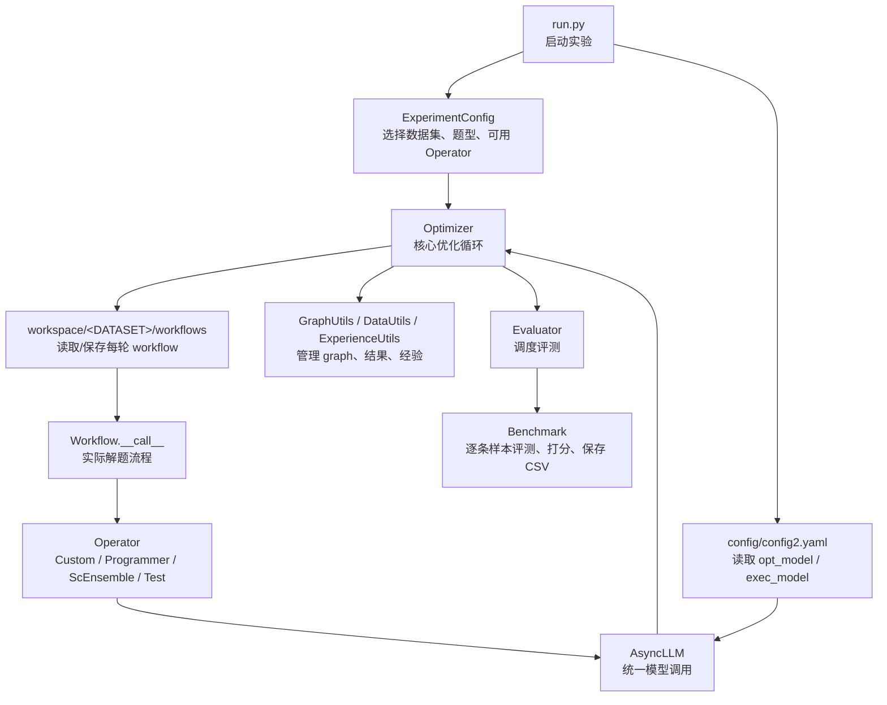
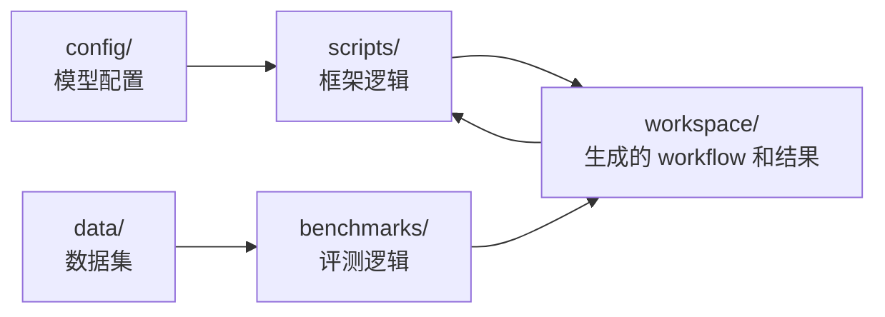

# AFlow 学习与二次开发指南

这份文档面向从 0 入门 AFlow，并最终把它改造成适配自己数据、内部模型、约束输入输出格式的二次开发场景。

## 1. 先理解 AFlow 在做什么

AFlow 不是一个训练模型的项目，而是一个自动优化 Agent Workflow 的框架。

它的核心思想是：

```text
给定一个初始 workflow
  -> 用优化模型分析历史表现和失败案例
  -> 让模型生成新的 workflow 代码
  -> 在验证集上评测新 workflow
  -> 根据分数、日志和经验继续下一轮优化
```

也就是说，AFlow 优化的对象不是模型参数，而是“工作流代码”。

从传统机器学习视角看，AFlow 的特别之处在于：

```text
传统训练：优化模型参数
AFlow：优化 Agent workflow 代码
```

也就是把“怎么调用模型、怎么组织推理步骤、怎么自检、怎么投票、怎么用工具”这件事代码化，然后让另一个更强的 LLM 去持续改进这段代码。

## 2. 项目总体架构

AFlow 可以分成 6 个核心层：

```text
入口层：run.py
配置层：config/config2.yaml
模型层：scripts/async_llm.py
工作流层：workspace/.../graph.py + scripts/operators.py
优化层：scripts/optimizer.py + scripts/optimizer_utils/
评测层：scripts/evaluator.py + benchmarks/
```

整体关系图：



你可以把它理解成：

```text
run.py 负责启动
Optimizer 负责自动改 workflow
Workflow 负责实际解题
Operator 负责封装可复用动作
AsyncLLM 负责调用模型
Benchmark 负责判断答案好不好
workspace 负责保存每一轮生成出来的 workflow 和结果
```

## 3. AFlow 的核心设计思想

### 思想 1：Workflow 是可执行代码

AFlow 不把 Agent 工作流存成纯文本配置，而是存成 Python 代码。

典型位置：

```text
workspace/MATH/workflows/round_1/graph.py
```

这意味着一个 workflow 可以表达很复杂的控制逻辑：

```text
一次调用 LLM
多次调用 LLM
并行生成多个答案
自一致投票
调用代码执行器
根据失败反馈重试
组合多个 Operator
```

这也是 AFlow 最值得学习的地方：它把 Agent 的“流程结构”变成了可以被搜索和改写的对象。

### 思想 2：Operator 是工作流积木

如果让优化模型随便写任意代码，搜索空间会很大，也容易写坏。

所以 AFlow 提供了一组 Operator，让模型主要在这些积木之间做组合：

```text
Custom：普通 LLM 生成
AnswerGenerate：面向 QA 的答案生成
ScEnsemble：多答案自一致选择
Programmer：生成并执行 Python 代码
Test：对代码题测试并反思修正
CustomCodeGenerate：生成指定函数形式代码
```

Operator 的设计思想是：

```text
把常见 Agent 能力封装成稳定接口
让 workflow 只负责编排这些能力
让优化器更容易搜索到有效结构
```

对于你的二次开发，新增内部能力时，优先考虑新增 Operator，而不是把所有逻辑塞进一个巨大的 prompt。

### 思想 3：Benchmark 是反馈信号

AFlow 是否优化成功，不靠主观感觉，而靠 Benchmark 分数。

Benchmark 做三件事：

```text
读取样本
调用 workflow 得到 prediction
根据 expected_output 计算 score
```

因此你的自定义数据、输出格式、评分规则，核心都应该落在 Benchmark 里。

### 思想 4：优化器通过历史经验改进

每一轮优化不是凭空生成新 workflow，而是参考：

```text
历史表现较好的 workflow
当前 workflow 代码
prompt.py
operator 描述
历史 score
失败日志 log.json
processed_experience.json
```

然后让 `opt_model` 生成：

```text
modification：这轮改了什么
graph：新的 workflow 代码
prompt：新的 prompt 文件
```

这是 AFlow 的反馈闭环。

## 4. 一次完整运行的链路

当你运行：

```bash
python run.py --dataset MATH --max_rounds 1
```

大致发生这些事：

```mermaid
sequenceDiagram
    participant User as 用户
    participant Run as run.py
    participant Opt as Optimizer
    participant W as workspace
    participant LLM as opt_model
    participant Eval as Evaluator
    participant Bench as Benchmark
    participant Flow as Workflow
    participant Exec as exec_model

    User->>Run: python run.py --dataset MATH
    Run->>Run: 读取 ExperimentConfig
    Run->>Run: 读取 config/config2.yaml
    Run->>Opt: 创建 Optimizer
    Opt->>W: 读取历史 workflow / results / experience
    Opt->>LLM: 请求生成新的 graph 和 prompt
    LLM-->>Opt: 返回 modification / graph / prompt
    Opt->>W: 保存 round_N/graph.py 和 prompt.py
    Opt->>Eval: 评测新 workflow
    Eval->>Bench: 加载 validate 数据
    Bench->>Flow: 对每条样本调用 Workflow.__call__
    Flow->>Exec: 通过 Operator 调用执行模型
    Exec-->>Flow: 返回答案
    Flow-->>Bench: 返回 prediction 和 cost
    Bench->>Bench: calculate_score
    Bench-->>Eval: 平均分和成本
    Eval-->>Opt: 返回 score
    Opt->>W: 保存 results.json / log.json / experience
```

这条链路是你理解整个项目的主线。

## 5. 仓库目录结构怎么看

```text
Aflow/
├── run.py                         # 主入口：启动优化实验
├── run_baseline.py                # 跑 baseline
├── requirements.txt               # Python 依赖
├── config/
│   └── config2.example.yaml       # 模型配置示例
├── scripts/
│   ├── optimizer.py               # 优化主循环
│   ├── async_llm.py               # 模型调用封装
│   ├── operators.py               # Agent 操作积木
│   ├── evaluator.py               # 评测调度
│   ├── workflow.py                # Workflow 抽象基类
│   ├── formatter.py               # LLM 输出格式校验
│   ├── prompts/                   # 优化 prompt 和任务 prompt
│   └── optimizer_utils/           # graph、data、experience、convergence 等工具
├── benchmarks/
│   ├── benchmark.py               # Benchmark 基类
│   ├── math.py                    # MATH 评测
│   ├── gsm8k.py                   # GSM8K 评测
│   ├── humaneval.py               # HumanEval 评测
│   └── ...                        # 其他数据集评测
├── workspace/
│   └── MATH/workflows/            # 自动生成/保存的 workflow
└── data/
    └── datasets/                  # validate/test 数据
```

最重要的目录关系：



## 6. 仓库核心代码量

当前仓库大致代码量：

```text
scripts/ 核心框架代码：约 3400 行
benchmarks/ 数据集评测代码：约 1550 行
run.py 入口：140 行
```

真正二次开发时需要优先理解的代码大概 1000-1800 行。

优先级最高的文件：

```text
run.py
scripts/optimizer.py
scripts/async_llm.py
scripts/operators.py
scripts/evaluator.py
benchmarks/benchmark.py
workspace/MATH/workflows/round_1/graph.py
```

## 7. 最需要重点看的代码

### 第一优先级：必须看

#### 1. `run.py`

作用：

```text
定义支持哪些数据集
定义每个数据集的问题类型
定义每个数据集可使用哪些 Operator
读取 opt_model 和 exec_model
创建 Optimizer
启动 optimize("Graph")
```

你需要重点看：

```text
EXPERIMENT_CONFIGS
parse_args()
LLMsConfig.default()
Optimizer(...)
optimizer.optimize("Graph")
```

这是整个项目的启动地图。

#### 2. `scripts/optimizer.py`

作用：

```text
实现 AFlow 的自动优化循环
负责读取旧 workflow
负责调用 opt_model 生成新 workflow
负责调用 evaluator 评测
负责保存分数和经验
```

你需要重点看：

```text
Optimizer.optimize()
Optimizer._optimize_graph()
GraphOptimize
_extract_fields_from_response()
```

这是整个项目最核心的文件。

#### 3. `scripts/async_llm.py`

作用：

```text
统一封装模型调用
读取 config/config2.yaml
创建 AsyncOpenAI client
统计 token 和成本
支持格式化调用 call_with_format()
```

你需要重点看：

```text
LLMConfig
LLMsConfig.default()
LLMsConfig.get()
AsyncLLM.__call__()
AsyncLLM.call_with_format()
create_llm_instance()
```

如果你要接内部模型，这个文件一定要看。

#### 4. `scripts/operators.py`

作用：

```text
定义 workflow 可用的 Agent 操作积木
每个 Operator 通常封装一次或多次 LLM 调用
部分 Operator 会执行代码、测试、投票或修正
```

你需要重点看：

```text
Operator
Custom
ScEnsemble
Programmer
Test
AnswerGenerate
CustomCodeGenerate
```

如果你要增加内部工具能力，这个文件是主要改造点。

#### 5. `scripts/evaluator.py`

作用：

```text
根据 dataset 名称选择对应 Benchmark
加载 validate/test 数据路径
实例化 workflow
调用 benchmark.run_evaluation()
```

你需要重点看：

```text
DatasetType
dataset_configs
graph_evaluate()
_configure_graph()
_get_data_path()
```

如果你要新增自己的数据集，这里必须注册。

#### 6. `benchmarks/benchmark.py`

作用：

```text
定义所有 Benchmark 的基类
加载 JSONL 数据
并发评测所有样本
保存 CSV 结果
定义子类必须实现的接口
```

你需要重点看：

```text
load_data()
run_evaluation()
evaluate_all_problems()
evaluate_problem()
calculate_score()
get_result_columns()
```

你的自定义数据、输出格式和打分逻辑，主要从这里扩展。

#### 7. `workspace/MATH/workflows/round_1/graph.py`

作用：

```text
展示 workflow 实际长什么样
这是被 Evaluator 动态 import 并执行的代码
```

你需要理解：

```text
Workflow.__init__()
Workflow.__call__()
operator.Custom(self.llm)
return prediction, cost
```

这个文件能帮你真正理解“workflow 是代码”。

### 第二优先级：建议看

#### 1. `scripts/optimizer_utils/graph_utils.py`

负责：

```text
创建 round 目录
动态加载 workflow graph.py
读取 graph.py / prompt.py
加载 operator 描述
构造优化 prompt
写入新的 workflow 文件
```

尤其看：

```text
load_graph()
read_graph_files()
create_graph_optimize_prompt()
write_graph_files()
```

#### 2. `scripts/optimizer_utils/data_utils.py`

负责：

```text
读取 results.json
选择 top rounds
读取 log.json
保存新一轮结果
```

这决定优化器参考哪些历史 workflow。

#### 3. `scripts/optimizer_utils/experience_utils.py`

负责：

```text
读取 processed_experience.json
检查 modification 是否重复
更新历史经验
```

这决定优化器如何利用历史经验。

#### 4. `scripts/optimizer_utils/evaluation_utils.py`

负责：

```text
连接 Optimizer 和 Evaluator
把当前 workflow 拿去评测
把分数写入 results.json
```

#### 5. `scripts/formatter.py`

负责：

```text
约束 LLM 输出格式
把模型输出解析成 dict / text / code
```

如果你很在意固定 JSON 输出，这个文件值得看。

#### 6. `scripts/prompts/optimize_prompt.py`

负责：

```text
告诉 opt_model 应该如何改 workflow
定义 workflow 优化时的系统提示词和模板
```

如果你想改变“优化器的优化风格”，看这里。

### 第三优先级：按需看

```text
benchmarks/math.py：数学题评分逻辑
benchmarks/gsm8k.py：GSM8K 评分逻辑
benchmarks/humaneval.py：代码题评分逻辑
benchmarks/mbpp.py：代码题评分逻辑
scripts/utils/code.py：代码题测试辅助
scripts/utils/lcb_runner.py：LiveCodeBench 相关，代码较多，可后看
```

如果你自己的任务不是代码题，`lcb_runner.py` 可以暂时跳过。

## 8. 推荐学习顺序

### 第 1 步：跑通项目

先进入环境：

```bash
cd /Users/levenli/Desktop/code/Aflow
micromamba activate aflow
```

项目运行前需要准备模型配置：

```text
config/config2.yaml
```

可以参考：

```text
config/config2.example.yaml
```

如果内部模型兼容 OpenAI Chat Completions 接口，配置大致长这样：

```yaml
models:
  internal-opt-model:
    base_url: "http://your-internal-model-endpoint/v1"
    api_key: "your-api-key"
    temperature: 0.7

  internal-exec-model:
    base_url: "http://your-internal-model-endpoint/v1"
    api_key: "your-api-key"
    temperature: 0
```

然后可以尝试：

```bash
python run.py --dataset MATH \
  --opt_model_name internal-opt-model \
  --exec_model_name internal-exec-model \
  --max_rounds 1
```

第一次建议只跑一轮，先确认链路能通。

### 第 2 步：看入口文件

重点看：

```text
run.py
```

你需要理解：

```text
EXPERIMENT_CONFIGS 如何定义数据集
dataset 对应什么 question_type
每个数据集允许使用哪些 operators
opt_model_name 和 exec_model_name 分别做什么
Optimizer 是如何被初始化的
```

其中两个模型的分工：

```text
opt_model：优化 workflow，用来生成/改写新的工作流代码，通常需要更强
exec_model：执行 workflow，用来实际处理样本，可以相对便宜
```

### 第 3 步：看核心优化器

重点看：

```text
scripts/optimizer.py
```

尤其是：

```text
Optimizer.optimize()
Optimizer._optimize_graph()
```

核心流程是：

```text
读取历史 workflow 和分数
选择一个历史表现较好的 round
读取对应 graph.py 和 prompt.py
读取经验文件 processed_experience.json
构造 workflow 优化 prompt
调用 opt_model 生成新的 graph / prompt / modification
保存为新的 round
调用 evaluator 评测
记录结果和经验
```

这里是 AFlow 的心脏。

## 9. 关键概念

### Workflow

Workflow 是真正被执行的工作流。

示例文件：

```text
workspace/MATH/workflows/round_1/graph.py
```

一个最简 workflow 长这样：

```python
class Workflow:
    def __init__(self, name, llm_config, dataset):
        self.name = name
        self.dataset = dataset
        self.llm = create_llm_instance(llm_config)
        self.custom = operator.Custom(self.llm)

    async def __call__(self, problem: str):
        solution = await self.custom(input=problem, instruction="")
        return solution["response"], self.llm.get_usage_summary()["total_cost"]
```

你可以把它理解为：

```text
输入 problem
调用一个或多个 operator
返回 prediction 和 cost
```

### Operator

Operator 是可复用的工作流组件。

重点文件：

```text
scripts/operators.py
```

已有常见 Operator：

```text
Custom：直接根据 instruction + input 调用 LLM
AnswerGenerate：问答生成
ScEnsemble：自一致选择答案
Programmer：让 LLM 写 Python 代码并执行
Test：对代码题进行测试和反思修正
CustomCodeGenerate：生成指定函数形式的代码
```

如果你要给内部业务增加特定能力，通常是在这里加新的 Operator。

例如：

```text
结构化 JSON 生成 Operator
内部知识库检索 Operator
规则校验 Operator
SQL 生成 Operator
标签分类 Operator
```

### Benchmark

Benchmark 负责评测 workflow 的输出。

重点文件：

```text
benchmarks/benchmark.py
benchmarks/math.py
benchmarks/gsm8k.py
```

所有自定义数据集都应该继承 `BaseBenchmark`，并实现三个方法：

```python
async def evaluate_problem(self, problem: dict, agent):
    pass

def calculate_score(self, expected_output, prediction):
    pass

def get_result_columns(self):
    pass
```

你自己的数据格式、输出格式、评分规则，主要都应该放在 Benchmark 里。

## 10. 如果要接自己的数据

假设你的数据是 JSONL，每行长这样：

```json
{"input": "用户问题", "expected": "标准答案", "meta": {"type": "A"}}
```

你应该新增：

```text
benchmarks/internal.py
```

大致结构：

```python
from typing import Any, Tuple, List
from benchmarks.benchmark import BaseBenchmark


class InternalBenchmark(BaseBenchmark):
    async def evaluate_problem(self, problem: dict, agent) -> Tuple[Any, ...]:
        input_text = problem["input"]
        expected = problem["expected"]

        prediction, cost = await agent(input_text)
        score, extracted = self.calculate_score(expected, prediction)

        return input_text, expected, prediction, extracted, score, cost

    def calculate_score(self, expected_output: Any, prediction: Any):
        extracted = str(prediction).strip()
        score = 1.0 if extracted == str(expected_output).strip() else 0.0
        return score, extracted

    def get_result_columns(self) -> List[str]:
        return ["input", "expected", "prediction", "extracted", "score", "cost"]
```

然后在：

```text
scripts/evaluator.py
```

注册新数据集：

```python
from benchmarks.internal import InternalBenchmark

DatasetType = Literal[
    "HumanEval",
    "MBPP",
    "GSM8K",
    "MATH",
    "HotpotQA",
    "DROP",
    "LiveCodeBench",
    "Internal",
]

self.dataset_configs = {
    ...
    "Internal": InternalBenchmark,
}
```

还要修改数据路径逻辑：

```python
def _get_data_path(self, dataset: DatasetType, test: bool) -> str:
    base_path = f"data/datasets/{dataset.lower()}"
    return f"{base_path}_test.jsonl" if test else f"{base_path}_validate.jsonl"
```

因此你可以准备：

```text
data/datasets/internal_validate.jsonl
data/datasets/internal_test.jsonl
```

## 11. 如果要约束输入输出格式

建议先把格式约束分成两层处理。

### 第一层：Prompt 约束

在 workflow 或 operator prompt 中要求模型输出指定格式。

例如：

```text
请严格输出 JSON：
{
  "answer": "...",
  "reason": "...",
  "confidence": 0.0
}
```

### 第二层：Benchmark 强校验

不要只相信 prompt。

在 `calculate_score()` 里做严格解析：

```python
import json

def calculate_score(self, expected_output, prediction):
    try:
        data = json.loads(prediction)
    except Exception:
        return 0.0, {"error": "invalid_json", "raw": prediction}

    if "answer" not in data:
        return 0.0, {"error": "missing_answer", "raw": data}

    score = 1.0 if data["answer"] == expected_output else 0.0
    return score, data
```

你的输出格式越严格，越应该把校验写在 Benchmark，而不是只写在 prompt 里。

## 12. 如果要接内部模型

重点文件：

```text
scripts/async_llm.py
```

当前实现使用：

```python
from openai import AsyncOpenAI

self.aclient = AsyncOpenAI(
    api_key=self.config.key,
    base_url=self.config.base_url,
)
```

如果内部模型兼容 OpenAI API，只需要改配置。

如果不兼容，需要改：

```text
AsyncLLM.__call__()
```

把这里：

```python
response = await self.aclient.chat.completions.create(...)
```

替换成你们内部模型的 SDK 或 HTTP 请求。

注意保留统一返回：

```python
return ret
```

以及成本统计逻辑。如果内部模型没有 token usage，可以先返回 0 成本。

## 13. 如果要新增自己的 Operator

适合新增 Operator 的情况：

```text
你需要固定输出 JSON
你需要调用内部工具
你需要做规则校验
你需要调用检索系统
你需要组合多次 LLM 调用
你需要对答案进行后处理
```

新增位置：

```text
scripts/operators.py
```

一个简单示例：

```python
class JsonAnswer(Operator):
    def __init__(self, llm: AsyncLLM, name: str = "JsonAnswer"):
        super().__init__(llm, name)

    async def __call__(self, input: str, instruction: str = ""):
        prompt = f"""
{instruction}

请严格输出 JSON，格式如下：
{{
  "answer": "...",
  "reason": "..."
}}

输入：
{input}
"""
        response = await self.llm(prompt)
        return {"response": response}
```

然后需要在 workflow template 的 operator 描述中暴露它。

每个数据集的 operator 描述通常在：

```text
workspace/<DATASET>/workflows/template/operator.json
```

例如：

```json
{
  "JsonAnswer": {
    "description": "Generates a strict JSON answer with answer and reason fields.",
    "interface": "json_answer(input: str, instruction: str = '') -> dict with key 'response' of type str"
  }
}
```

还要在 `run.py` 的 `EXPERIMENT_CONFIGS` 中加入这个 Operator 名称。

## 14. 二次开发推荐路线

不要一开始就做完整系统。

推荐路线：

```text
1. 先配置内部模型，确保单次 LLM 调用能通
2. 复制一个现有数据集配置，新增 Internal 数据集
3. 准备 10-20 条小规模 validate 数据
4. 新增 benchmarks/internal.py
5. 在 scripts/evaluator.py 注册 Internal
6. 在 run.py 注册 Internal 的 ExperimentConfig
7. 复制 workspace/MATH 作为 workspace/Internal 的初始 workflow
8. 只跑 max_rounds=1
9. 确认评测结果 CSV、log.json、results.json 都正常
10. 再逐步增加 max_rounds 和样本数量
11. 最后再新增复杂 Operator 和严格输出格式
```

## 15. 重点代码阅读顺序速查

### 第一组：必须读

```text
run.py
scripts/optimizer.py
scripts/evaluator.py
benchmarks/benchmark.py
workspace/MATH/workflows/round_1/graph.py
scripts/operators.py
scripts/async_llm.py
```

### 第二组：建议读

```text
scripts/optimizer_utils/graph_utils.py
scripts/optimizer_utils/data_utils.py
scripts/optimizer_utils/evaluation_utils.py
scripts/optimizer_utils/experience_utils.py
scripts/formatter.py
scripts/prompts/optimize_prompt.py
```

### 第三组：按需读

```text
benchmarks/math.py
benchmarks/gsm8k.py
benchmarks/humaneval.py
benchmarks/mbpp.py
scripts/utils/code.py
scripts/utils/lcb_runner.py
```

如果你的任务不是代码题，可以暂时不读 `lcb_runner.py`。

## 16. 学习目标检查表

学完第一阶段，你应该能回答：

```text
run.py 如何启动优化？
opt_model 和 exec_model 有什么区别？
workflow 的 graph.py 是如何被加载的？
operator 是怎么被 workflow 调用的？
benchmark 是如何计算分数的？
结果保存在哪里？
失败案例保存在哪里？
```

学完第二阶段，你应该能做到：

```text
新增一个自己的数据集
跑通自己的 validate 数据
约束输出格式
对格式错误打 0 分
接入内部 OpenAI-compatible 模型
用 max_rounds=1 做最小闭环测试
```

学完第三阶段，你应该能做到：

```text
新增自己的 Operator
让优化器知道这个 Operator 的接口
让模型自动组合你的 Operator
分析每轮 workflow 的变化
根据日志改进 prompt / scoring / operator
```

## 17. 最小可行二次开发目标

建议你的第一个目标不要太大。

第一个可行目标：

```text
使用内部模型
使用自己的 20 条验证数据
要求输出固定 JSON
能跑 max_rounds=1
能生成结果 CSV
能看到每条样本 score
```

第二个目标：

```text
跑 max_rounds=3
观察 workflow 是否发生变化
观察分数是否提升
检查失败案例是否被记录
```

第三个目标：

```text
新增一个内部业务 Operator
让优化器在 workflow 中使用它
比较使用前后的分数变化
```

## 18. 我的理解重点

这个项目最值得学习的不是某一个具体算法实现，而是它的工程思想：

```text
把 Agent workflow 代码化
把 workflow 的改进过程交给 LLM
把效果评估交给 Benchmark
把历史经验和失败日志反馈给下一轮优化
```

你二次开发时，不需要完全照搬原项目的所有 benchmark。

你真正要复用的是：

```text
Workflow 表示方式
Operator 抽象
Benchmark 评测闭环
Optimizer 自动改写 workflow 的机制
```

只要这四个点打通，AFlow 就可以迁移到你的内部数据和内部模型上。
